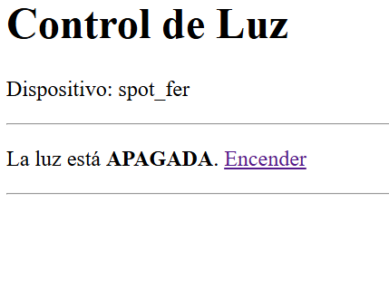

# Pruebas de aceptación manuales

## Historia de usuario H1 y H2

Criterios:

- CA1.1 El *Spot WiFi* puede conectarse a la red WiFi local.
- CA1.2 El *Spot WiFi* provee un servidor http.
- CA1.3 El servidor sirve al menos un *panel de control web* del Spot.
- CA1.4 El *panel de control web* debe incluir al menos la identidad del Spot.

- CA2.1 El *Spot WiFi* debe responder a peticiones de mDNS, permitiendo resolver una dirección de tipo *reflector_&lt;id&gt;.local*
- CA2.2 La dirección mDNS debe ser visible en el cuerpo del Spot.
- CA2.3 Navegando a la dirección resuelta se accede al *panel de control web* del *Spot WiFi*.

### Prueba iniciada el 2025-10-30 a las 19:30

El dispositivo es encendido y se monitorea un registro de eventos mediante interfaz serie, encontrándose que el dispositivo toma dirección ip e inicializa su servidor multicast DNS:

```
Obtenida IP: 172.16.42.179
MDNS iniciado con exito
```

Se concluye que verifica CA1.1 (conexión, ip), CA2.2 (etiqueta) y hay evidencia de CA2.1 (log de incio de mDNS)

Acto seguido se navega a http://spot_fer/ desde una máquina en la misma red (donde spot_fer es el id del dispositivo, que figura en el cuerpo del spot) obteniéndose el siguiente panel de control



Este panel contiene al menos la id del dispositivo, se concluye que verifica CA1.2, CA1.3, CA1.4, CA2.1 y CA2.3

Fin de la prueba

## Historia de usuario H3
